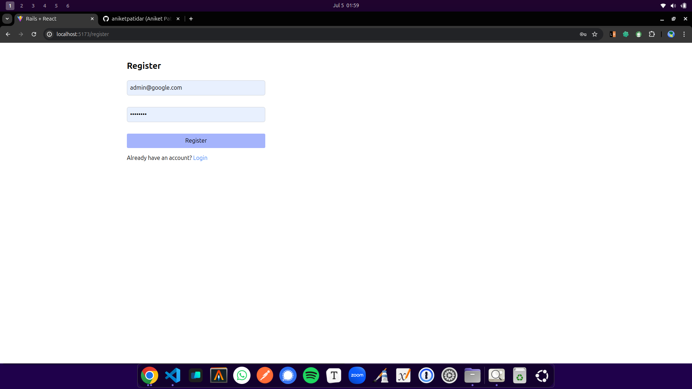
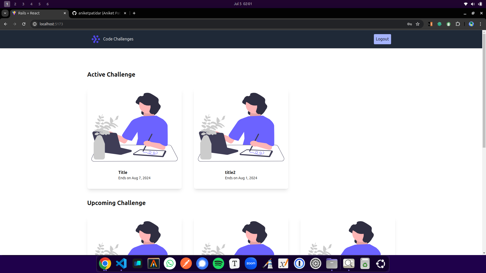
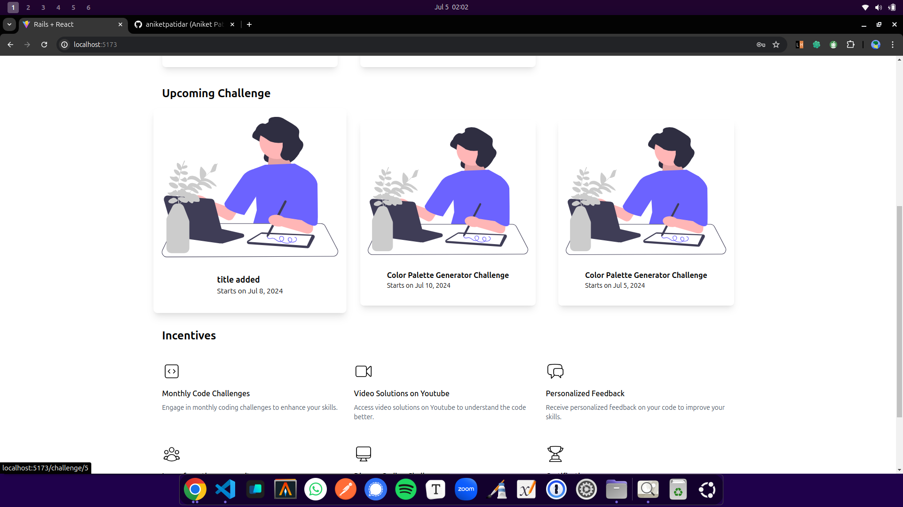
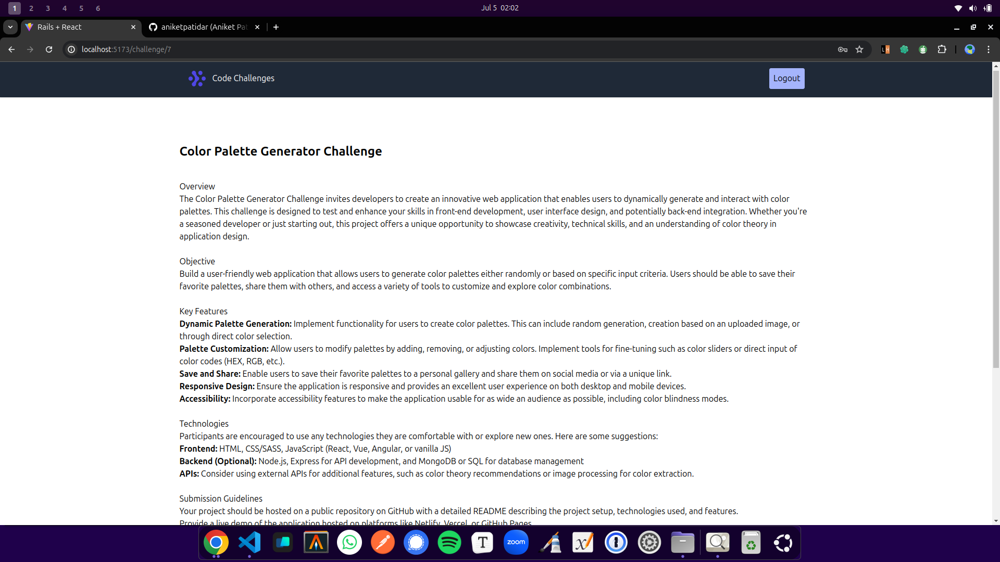

# Coding Challenges
## Achieve mastery by challenging yourself with small coding exercises that are crafted to help you strengthen different coding techniques.
A full-stack web application built with React and Ruby on Rails. The application allows users to log in, log out, and view various coding challenges. Challenges can be categorized as upcoming, ongoing, or completed. Users can participate in these challenges, while admin users have the ability to add new challenges and evaluate user submissions.

## Features

- [x] User Authentication: Log in and log out.
- [x] View Challenges: Browse through all challenges categorized as upcoming, ongoing, or completed.
- [ ] Participate in Challenges: Users can take part in ongoing challenges.
- [ ] Admin Capabilities:
  - [x] Add New Challenges: Admin users can create new challenges.
  - [ ] Evaluate Submissions: Admin users can evaluate user submissions for challenges.

## Application Screenshots

### Registration Page

### Login Page

### Active Challenges

### Upcoming Challenges

### Challenge Details

