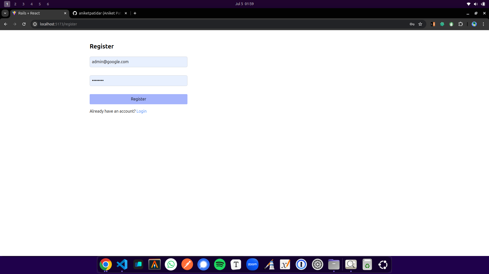
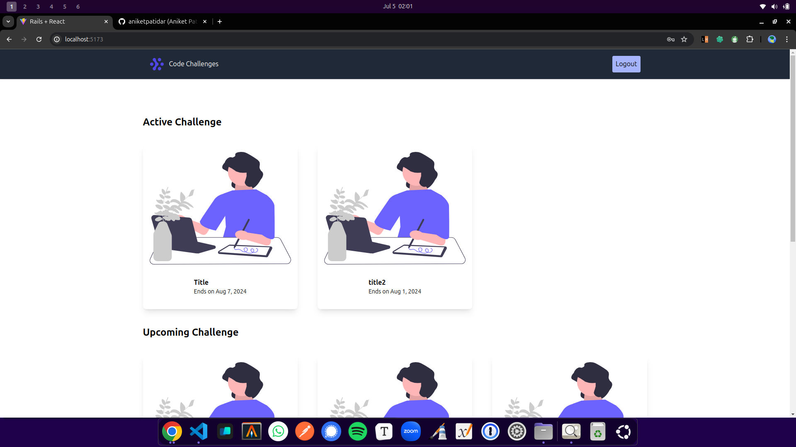
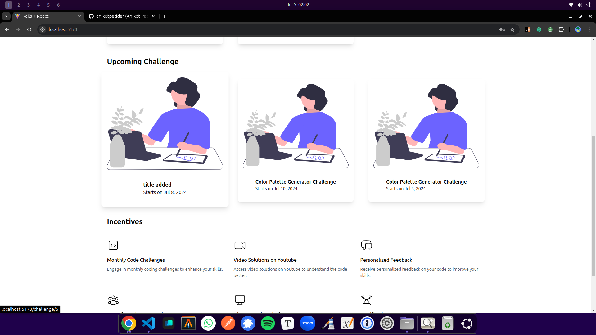
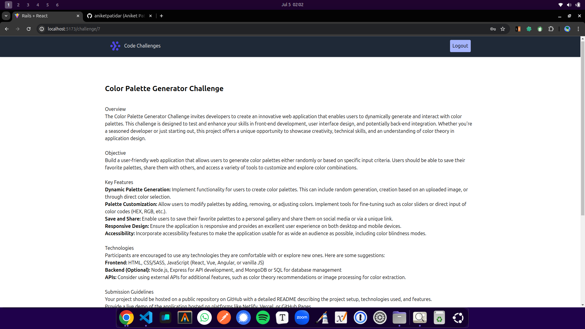

# code-challenges

Full-stack app for creating and solving coding challenges. Users can register, log in, browse challenges, and submit solutions. Admins can create and manage challenges.

## What

- Rails 7.1 API backend with Devise/JWT authentication, PostgreSQL
- React 18 frontend with Vite, Tailwind CSS, React Router

## Install

* Backend: `cd backend && bundle install`
* Frontend: `cd frontend && npm install`

## Run

* Backend: `cd backend && bin/setup`
* Frontend: `cd frontend && npm run dev`

## Screenshots

